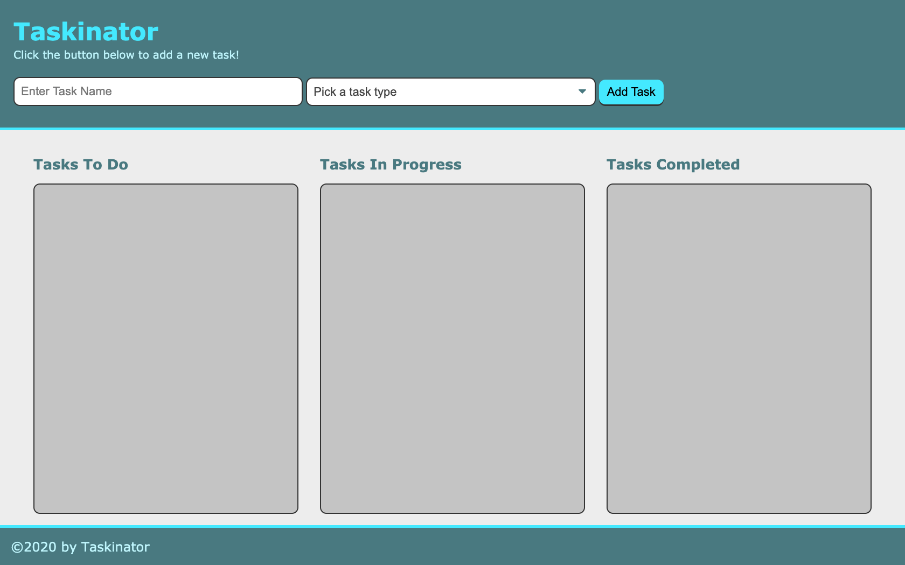

# Taskinator

## Description
This application was created to assist the user in managing tasks. Starting with creating a task, you can then edit and change the status of the task all the way to completion and if desired, deletion.

## Technologies
*HTML
*CSS
*JavaScript

## Website
https://lacey-griffith.github.io/taskinator/

## Image

## Contributions
Starting HTML and CSS were provided by the UT BootCamp.
JavaScript written by Lacey Griffith